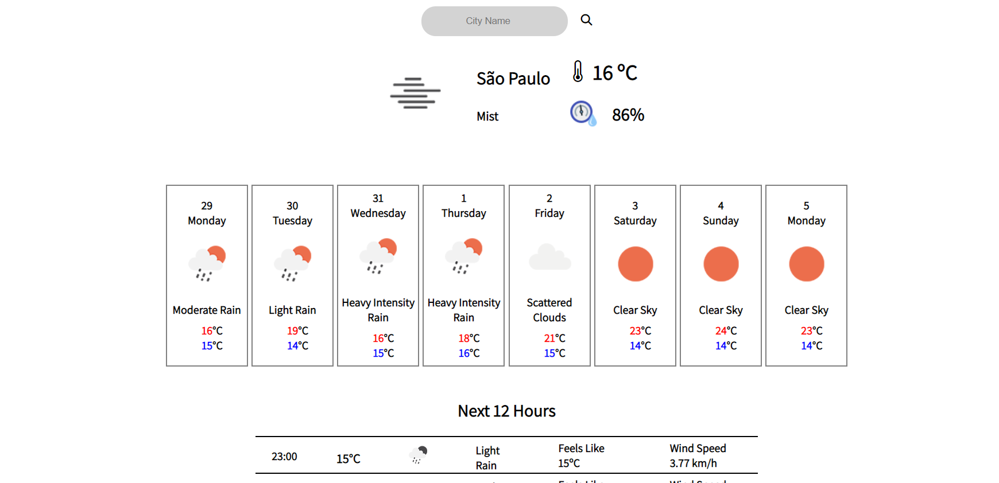

# Weather App

This is a weather application developed using HTML, CSS, JavaScript, and a REST API. The application allows users to retrieve weather forecast data for a specific city based on the IP address of the host running the application.

## Features

- Weather Forecast: Retrieve current weather conditions and forecast for a selected city.
- City Search: Enter a city name to view the weather forecast for that location.
- Automatic Location Detection: The application uses the IP address of the host to automatically detect the user's location and display the weather information.

## Usage

To use the Weather App, follow these steps:

1. Open the [Weather App](https://rbettarelli.github.io/Weather-APP/) in a web browser.
2. The app will automatically detect your location and display the weather forecast.
3. To search for weather information of a specific city, enter the city name in the search bar and press Enter.
4. The app will retrieve and display the weather forecast for the selected city.

## Contributing

Contributions to this weather application project are welcome. If you have any ideas, suggestions, or improvements, please feel free to submit a pull request.

## License

This project is licensed under the [MIT License](LICENSE).
